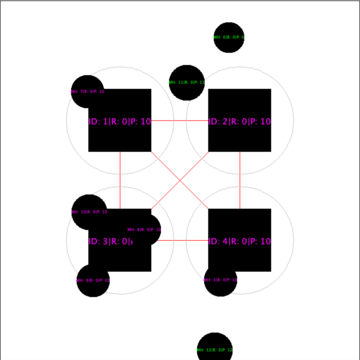
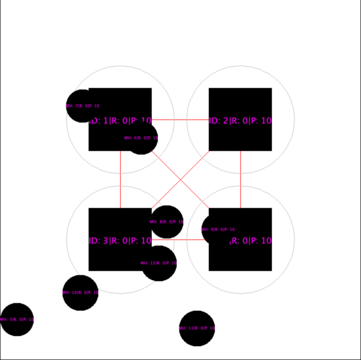

# Solving the consensus problem in a Mobile Environment

### Introduction

This project it's a possible solution to solve the consensus problem in a mobile environment. Our architecture is based on fixed Mobile Station Nodes (MSS) that have fixed coverage radius and Mobile Host Nodes (MH) that act like mobile nodes and can enter/exit MSS radius.  

Each MH Node must propose a value to one of the MSS Node, and when all MH Nodes have proposed the MSS Nodes try to reach consensus using chandra-toueg algorithm [1][2]. If consensus is reached all MH Nodes are notified to use the consensus value, but if consensus is not reached all MH Nodes are notified that there is no consensus and they can propose another value.  

To implement this solution it was used [Sinalgo](https://sinalgo.github.io/), which is a simulation framework for testing and validating network algorithms. To understand better how Sinalgo work and how to use it I trully recommend read the [tutorial](https://sinalgo.github.io/tutorial/Documentation.html) in Sinalgo's website.

### Implementation

At this report will not be explained how chandra&toueg consensus algorithm work, just some parts that is relevant to explain how it was implemented. To fully understand how it works I recommend read the papers [1][2].

#### Connectivity Model

It was used a single connectivity model to represent the connection between all nodes. First of all it was necessary to connect all MSS Nodes to each other, regardless the distance between then. So, when we are build the connection between nodes, if both nodes are MSS Nodes, than we connect them.  

Than it was necessary to build connection between MH Nodes and MSS Nodes based on their distances. To do that it was configurated a radius coverage for the MSS Nodes and when evaluate the connection between a MSS Node and a MH Node it was checked if the distance between them is lower than the radius coverage from this MSS Node.  

Note that for solution we assume that there is zones where none MSS Node can coverage, and there is no zone where more than one MSS Node can converage.

```
@Override
protected boolean isConnected(Node from, Node to) {
    if (from instanceof MSSNode && to instanceof MSSNode) {
        return true;
    } else if (from instanceof MSSNode && to instanceof MHNode || from instanceof MHNode && to instanceof MSSNode) {
        double dist = from.getPosition().squareDistanceTo(to.getPosition());
        return dist < rMaxSquare;
    }

    return false;
}
```


#### Messages

It was implemented one model for each message. There is messages implemented following `chandra&toueg` algorithm and messages to syncronize nodes states. Below there is the message list and a short explanation about each one.

> Propose value message: send to coordinator when a MSS Node want to propose a value to consensus (chandra&toueg). 

> Try message: broadcast from coordinator to all MSS Nodes when want to try a value proposed by one of the MSS Nodes (chandra&toueg)
 
> ACK message: send to coordinator when a MSS Node accept the try value from coordinator (chandra&toueg)

> NACK message: send to coordinator when a MSS Node not accept the try value from coordinator (chandra&toueg)

> Propose value defined message: broadcast from coordinator when consensus reached (chandra&toeug)

> Next round message: broadcast from coordinator to MSS Nodes when consensus failed and needs to go to next round with another coordinator (chandra&toueg)

> MH value message: send from MH Node to MSS Node to propose a value

> Buffer size message: send between MSS Nodes to syncronize buffer size and know if all MH Nodes has proposed values

> Notify round message: broadcast from MSS Nodes to all MH Nodes in range to notify that consensus failed and needs to go to next round. With this message MH Nodes know that they can propose another value again.
	
It is possible to access each model in `nodes/messages` directory.

#### Nodes

To describe both nodes logic I separated both in three phases, `preStep`, `step` and `postStep`, based on how Sinalgo works.  


> The preStep phase it is where run everything to prepare node for the next iteration.  
   
> The step phase it is where each node handle the incomming messages. At this moment it is possible to handle each kind of message and respond (if it is necessary) to a single node or every neighbour node. 
   
> The postStep phase it is where we increase a global timestamp and where we finish logic based on what happen in step phase.  

##### MSS Node

###### Pre step
In this phase we need to get three basic informations: 

- Quantity of MSS Nodes to chandra&toueg algorithm work properly
- Quantity of MH Nodes to know when all MH Nodes has proposed a value
- Which MSS Node is the coordinator in this round

After know get this three informations we can check if the current MSS Node can propose a value to the coordinator (based on what has been received from MH Nodes).  

Besides that, at this moment if the consensus has been reached the node will broadcast to all connected nodes (note that can be any MSS Node or MH Node) the consensus message. It is important that this broadcast happens all pre step phase after consensus has been reached, because MH Nodes can move, so it is possible to some MH Node get this consensus message some time after it has been reached.

```
@Override
public void preStep() {
    totalMSSNodes = discoverTotalMSSNodes();
    totalMHNodes = discoverTotalMHNodes();
    coordinator = (MSSNode) findCoordinator();

    if (!propose && allMHSent && !decided) {
        if (!mssBuffer.isEmpty()) {
            proposeValue();
        }
    }

    if (decided) {
        broadcast(new ProposedValueDefinedMessage(proposedValue));
    }
}
```
###### Step

As mentioned before, in this phase it is where the current node will handle all incomming messages. So, for MSS Nodes it is possible to handle messages from MH Nodes to notify a proposed value, and messages from another MSS Nodes that will be described below.  

First possible message to be handled is coordinator responsability, that is the ProposeValueMessage. With this message the coordinator saves that a value is proposed, and when this buffer gets half filled, than the coordinator try a consensus (happens at post step phase). So, basically, at if coordinator received this message, at this moment it is only a buffer push.

```
private void handleProposeValueMessage(Node sender, ProposeValueMessage msg) {
  coordinatorBuffer.add(msg);
}
``` 

The second possible message to be handled happens when the coordinator try a consensus. All nodes will check if this coordinator is trustable, and if is will respond with ACK Message, otherwise will responde with NACK Message. In chandra&toueg solution the trustabilty in coordinator is decided by a fault detector, but to simplify the implementation it is used a probability model that can be configured in `Config.xml`.

```
private void handleTryValueMessage(Node sender, TryValueMessage msg) {
    Random random = new Random();

    if (random.nextDouble() <= nackProbability) {
        logger.logln(LogL.infoLog, "[MSSNode " + this.getID() + "] sending NACK to coordinator");
        send(new NackMessage(), coordinator);
    } else {
        logger.logln(LogL.infoLog, "[MSSNode " + this.getID() + "] sending ACK to coordinator");
        send(new AckMessage(), coordinator);
    }
}
```
Another possible incomming message is ACK Message and NACK Message. This messages will be handled only by coordinator, and increment ackBuffer and nackBuffer to know if the consensus failed or not. If consensus has been reached, than the node broadcast a consensus message, otherwise broadcast a new round message, where all states are reseted and a new coordinator is choose.

```
private void handleAckMessage(Node sender, AckMessage msg) {
    ackBuffer.add(msg);

    if (ackBuffer.size() >= (totalMSSNodes + 1) / 2) {
        logger.logln(LogL.infoLog, "[Coordinator " + this.getID() + "] Message accepted! Broadcasting value defined: " + proposedValue);
        ackBuffer.clear();
        nackBuffer.clear();

        ProposedValueDefinedMessage proposedValueDefinedMessage = new ProposedValueDefinedMessage(proposedValue);

        broadcast(proposedValueDefinedMessage);
        handleProposedValueDefinedMessage(this, proposedValueDefinedMessage);
    }
}

private void handleNackMessage(Node sender, NackMessage msg) {
    nackBuffer.add(msg);

    if (nackBuffer.size() >= (totalMSSNodes + 1) / 2) {
        logger.logln(LogL.infoLog, "[Coordinator " + this.getID() + "] Message not accepted! Skip round...");
        ackBuffer.clear();
        nackBuffer.clear();

        broadcastNextRound();
    }
}
```
Another possible message is the consensus reached message, where the consensus value is setted for this node and the algorithms end.

```
private void handleProposedValueDefinedMessage(Node sender, ProposedValueDefinedMessage msg) {
    if (!decided) {
        logger.logln(LogL.infoLog, "[MSSNode " + this.getID() + "] consensus reached at " + ts);
    }

    decided = true;
    proposedValue = msg.getValue();
    propose = false;
    coordinatorBuffer.clear();
}
```
The last message is the next round message. As mentioned before, with this message every control variables and buffers are reseted to initial state, round is increased and a new coordinator is defined.

```
private void handleProposedValueDefinedMessage(Node sender, ProposedValueDefinedMessage msg) {
    if (!decided) {
        logger.logln(LogL.infoLog, "[MSSNode " + this.getID() + "] consensus reached at " + ts);
    }

    decided = true;
    proposedValue = msg.getValue();
    propose = false;
    coordinatorBuffer.clear();
}
```


###### Post step

In this phase happens some notification to MH Nodes, syncronization between MSS Nodes and some coordinator logic.  

First of all the coordinator node check if it is possible to try a consensus based on how many propose messages has received from another MSS Nodes. If his buffer is filled with more than half of possible incomming messages, than it is time to try a consensus.  

After that it is necessary to syncronize how many MH Nodes values each MSS Node has received.  

To end this phase the current MSS Node broadcast to all MH Nodes in range which round is.  

```
@Override
public void postStep() {
    // broadcast defined value if coordinator buffer contains at least (n + 1) / 2 values
    if (coordinatorBuffer.size() >= (totalMSSNodes + 1) / 2 && !coordinatorAlreadyProposedValue) {
        int value = getMostRecentProposedValue();
        TryValueMessage tryValueMessage = new TryValueMessage(value);

        coordinatorAlreadyProposedValue = true;
        proposedValue = value;
        coordinatorBuffer.clear();

        logger.logln(LogL.infoLog, "[Coordinator " + this.getID() +"] Proposing try value " + tryValueMessage.getValue());
        broadcast(tryValueMessage);
    }

    if (!allMHSent) {
        updateMSSNeighboursBufferSize();
    }

    checkAllMHSent();

    // Always broadcast notify round message. When any MH node receive this message it update round there and know if can propose another value
    broadcast(new NotifyRoundMessage(round));

    ts++;
}
```

##### MH Node

###### Pre step  
In this phase we get in which MSS Node the current MH Node is connected to. If the current MH Node is connected to any MSS Node, and hasn't proposed any value, than at this moment a value is proposed.
	

```
@Override
public void preStep() {
  MSSNode mssNodeConnectedTo = getMSSConnected();
  
  if (!proposed && mssNodeConnectedTo != null) {
    proposeValueToMSS(mssNodeConnectedTo);
  }
}
```

###### Step
In step phase all possible messages received will be handle. The MH Nodes can handle two types of message, one to be notified about a new round, and another to be notified that a consensus has been reached.  

When handle new round message we insure that it is possible to propose another value for this new round.

```
private void handleNotifyRoundMessage(Node sender, NotifyRoundMessage msg) {
    if (msg.getRound() != round) {
        round = msg.getRound();
        proposed = false;
    }
}
```

When handle consensus reached message the decided control variable is setted and we set the proposed value as the consensus value.

```
private void handleProposedValueDefinedMessage(Node sender, ProposedValueDefinedMessage msg) {
    if (!decided) {
        logger.logln(LogL.infoLog, "[MHNode " + this.getID() + "] consensus reached at " + ts);
    }

    decided = true;
    proposedValue = msg.getValue();
}
```

###### Post step

In post step phase is where the global timestamp is increased. With this variable is possible to know in which time the current node has been notified with consensus message, and in which time the current node proposed a value.

```
@Override
public void postStep() {
    ts++;
}
```

#### Display

To help understand what is happening at Sinalgo's interface were setted texts, custom colors and shapes.  

Squares represents MSS Nodes. Inside there is three informations: the node's id `[ID]`, in which round the node is `[R]` and which value the node propose `[P]`. When the node reach consensus the color change from blue to magenta.  

Circles represents MH Nodes. Inside there is three informations: the node's id `[MH]`, in which round the node is `[R]` and which value the node propose to one MSS Node. Before the node propose any value his color is red, after propose change to green and after received consensus message change to magenta.  






### Configuration

In `Config.xml` file is possible to edit some Sinalgo's configuration and our custom configuration for this project.  

  - NackProbability: set the probability do MSS Node send NACK message when coordinator propose value
  - UDG: set MSS Node radius
  - RandomWayPoint: set MH Node mobility configuration

```
<Custom>
  <RandomMessageTransmission distribution="Uniform" min="1" max="1"/>
  <Node defaultSize="10"/>
  <GeometricNodeCollection rMax="10000"/>
  <UDG rMax="300"/>
  <NackProbability value="0.5"/>

  <RandomWayPoint>
      <Speed distribution="Gaussian" mean="10" variance="20" />
      <WaitingTime distribution="Poisson" lambda="10" />
  </RandomWayPoint>
</Custom>
```

### Logging

It is possible to enable info logging  in `LogL` file. Just set `infoLog` to true if want to enable or false to disable. By default the logfile will be located in the logs folder inside sinalgo hidden directory in user's home. 


```
public static final boolean infoLog = true
```

This will enable log for MSS Nodes and MH Nodes. Each kind of node has his own log file: `mss_logfile.txt` for MSS Nodes; and `mh_logfile.txt` for MH Node.  

In MSS Node log is possible to verify `chandra&toueg` algorithm execution, with MSS Node proposing values to coordinator and sending ACK or NACK to accept the value or not. It will be also possible to see when consensus reach, and in which round each node received consensus message.  
In MH Node log is possible to verify when each MH node propose a value to a MSS Node and when each node received consensus message.  

### Analysis:

To do some analysis two points have been chosen: MH Nodes quantity that is related to relation between MH Nodes quantity and MSS Nodes quantity and MH Node displacement rate.

#### MH Nodes quantity

At this analysis I fixed the number of MSS Nodes in four, and increase MH Nodes quantity from twelve to twenty by four in each round. The hyphotesis here is that when we increase MH Nodes quantity, consequently decreasing MH/MSS relation, we will have a higher time to reach consensus in MSS Nodes, and a higher time to last MH Node receive consensus message. This happens because with more MH Nodes there is more chance than one node to be out of any MSS Node range, and knowing that for consensus happen it is necessary that all MH Nodes propose messages, this higher times will appear.


As we can see in the graphics above, our hyphotesis is true.

#### MH Node displacement rate

At this analysis the same scenarios were tested, but increasing MH Node displacement rate from (Speed distribuition="Gaussian" mean="10" variance="20") to (Speed distribuition="Gaussian" mean="20" variance="10"). Our hyphotesis here is that increasing MH Node speed the same scenarios will lead to lower times for reach consensus in MSS Nodes and to last MH Node received consensus message.


As we can see in the graphics above, our hyphotesis is true. But we can also verify that the time to reach consensus in MSS Nodes decrease more than time to last MH Nodes receibe consensus message.

# How to execute

- Copy models and node folders, ConfigGlobal and LogL to Sinalgo project template
- Copy Config.xml to resources/projects/<custom project> directory
- Run Sinalgo and chose your new custom project to run

### References

[1] [Chandra,Toueg,94]. Chandra, Toueg: Unreliable Failure Detectors for Reliable Distributed Systems (1994), Journal of the ACM, 1994.
[2] [Chandra,Hadzilacos,Toueg,96] The weakest failure detector for solving Consensus, (1996), http://citeseer.ist.psu.edu/chandra96weakest.html
